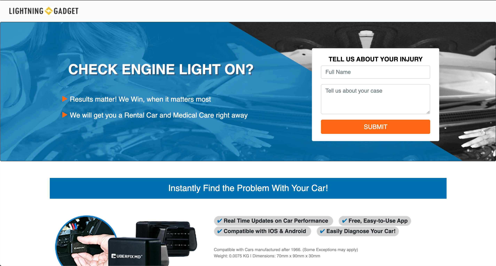

# Responsive

> Respnsive landing page

## Table of contents
* [Technologies](#technologies)
* [Screenshots](#screenshots)
* [Features](#features)
* [Status](#status)
* [Contact](#contact)

## Technologies
* CSS
* HTML

## Screenshots

## Features
List of features:
* Clean design
* Responsive

## Status
Project is: _finished_
* Make sure to check the web page [here](https://ramonpbarros.github.io/responsive/).

## Contact
Created by [@ramonpbarros](https://ramonpbarros.github.io/) - feel free to contact me!